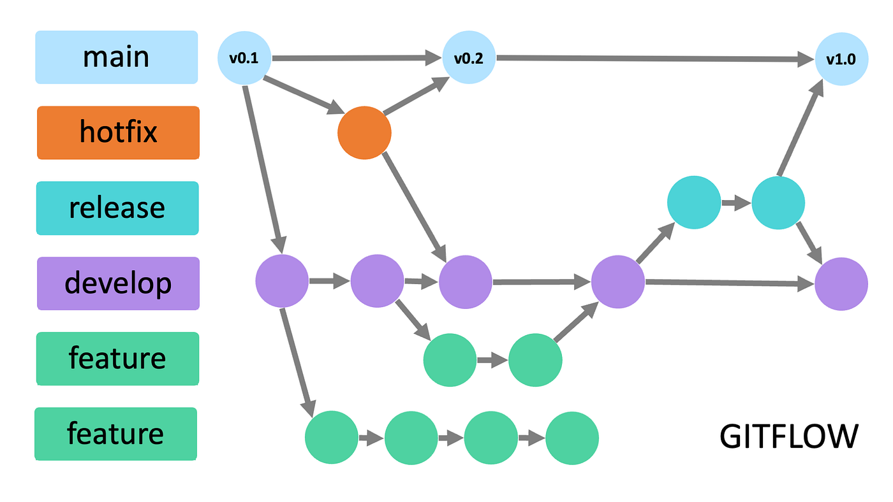

# tp-tacs-2026-2c-g1

TP de TACS: planificación de actividades grupales con reglas climáticas, votación de fechas
alternativas y notificaciones.

## Estructura del repositorio

- [`backend/`](backend/README.md) — API en Java 21 / Spring Boot. Instrucciones de build, Docker,
  autenticación y diseño en su propio README.
- [`frontend/`](frontend/README.md) — aplicación web (Next.js). Instrucciones de desarrollo y
  variables de entorno en su propio README.
- [`docs/`](docs) — documentación transversal (trazabilidad de user stories, casos de prueba,
  diagrama de git flow).
- [`design/`](design) — assets de diseño (plugin de Figma para generar las pantallas del prototipo).

Cada carpeta de proyecto (`backend/`, `frontend/`) tiene su propio `AGENTS.md` con el toolchain y
las convenciones específicas; ver [AGENTS.md](AGENTS.md) para el índice.

## Git flow



## Pre-commit

El repositorio incluye un hook que verifica el backend antes de cada commit (localiza un JDK 21
instalado y ejecuta `clean verify` dentro de `backend/`). Para activarlo una sola vez por
clonación:

```bash
git config core.hooksPath .githooks
```

El error `class file version 65.0 ... up to 61.0` indica que el código fue compilado con Java 21,
pero se intentó ejecutar con Java 17. El hook evita esa mezcla configurando Java 21 antes de Maven.

## Uso de inteligencia artificial

Durante el desarrollo utilizamos asistentes de IA generativa, principalmente ChatGPT y Claude,
como herramientas de apoyo. Su uso se concentró en las siguientes tareas:

- Generación y adaptación de código repetitivo o *boilerplate*.
- Propuesta de casos de prueba y revisión de la cobertura de tests.
- Revisión de las user stories para detectar requisitos, casos límite o validaciones que pudieran
  haberse omitido.
- Consulta de alternativas y opiniones para decisiones de diseño e implementación.
- Apoyo en la redacción y revisión de documentación técnica, incluyendo la creación y
  homogeneización de la documentación Javadoc del código.
- Apoyo en la aplicación y verificación del formato y de las herramientas de calidad del proyecto,
  como Spotless, Checkstyle y SpotBugs.
- Análisis de errores de compilación, tests y conflictos de integración.
- Modelado de Interfaz de Usuario.

Las respuestas de estas herramientas se tomaron como sugerencias y no como resultados definitivos.
El equipo revisó las propuestas, las adaptó al diseño y las convenciones del proyecto, y validó los
cambios mediante revisión del código, ejecución de tests y el proceso de verificación de Maven.
