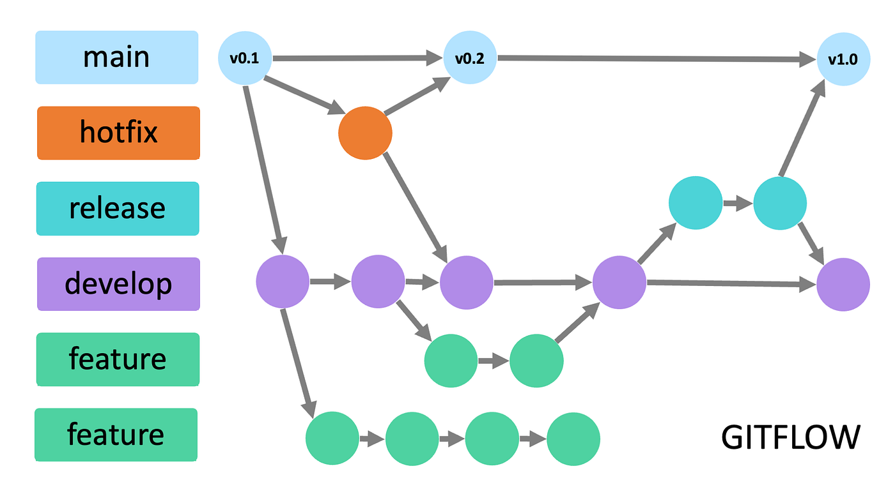

# tp-tacs-2026-2c-g1

Planazo es una aplicación web para organizar actividades, consultar el pronóstico, gestionar
participantes y resolver reprogramaciones mediante votaciones. El repositorio contiene el frontend
Next.js y la API Spring Boot, junto con toda la infraestructura necesaria para ejecutarlos
localmente y para desplegarlos en Google Cloud (ver [Despliegue en la nube](#despliegue-en-la-nube)).

## Requisitos

- Para ejecutar el sistema completo: Docker Engine con Docker Compose v2.
- Para ejecutar el backend fuera de Docker: JDK 21; Maven no es necesario porque se incluye el
  wrapper.
- Para ejecutar el frontend fuera de Docker: Node.js 22 y npm; se recomienda `npm ci` para una
  instalación reproducible.

## Cómo levantar la aplicación

El frontend queda disponible en `http://localhost:3000`, Keycloak en `http://localhost:8090`, la API
en `http://localhost:8080` y Swagger UI en `http://localhost:8080/swagger-ui.html`.

Ejemplo del JSON que debe enviarse en la parte `activity` de `POST /activities`:

```json
{
  "title": "Asado en la plaza",
  "description": "Junta con amigos, llevar sillas",
  "type": "OUTDOOR",
  "location": {
    "city": "Buenos Aires",
    "latitude": null,
    "longitude": null
  },
  "dateTime": "2026-08-25T18:00:00",
  "minParticipants": 4,
  "maxParticipants": 15,
  "weatherConditions": {
    "maxRainProbability": 30,
    "minTemperature": 10,
    "maxTemperature": 30,
    "maxWindSpeed": 25.0
  },
  "anticipationWindow": 24,
  "reprogramationRange": {
    "maxDays": 3,
    "initialHour": "10:00:00",
    "finalHour": "20:00:00"
  }
}
```

### Con Docker

Se requiere Docker con Docker Compose. Desde la raíz del proyecto, ejecutar:

```bash
docker compose up --build --wait
```

Este único comando construye y levanta frontend, backend, MongoDB, MinIO, Keycloak y su PostgreSQL.
Keycloak persiste realm, usuarios y sesiones en el volumen `keycloak-postgres-data`; el import del
realm inicial sólo crea el realm cuando aún no existe. Para detener
la aplicación, ejecutar `docker compose down`. `--wait` termina cuando los healthchecks confirman
que todos los servicios están listos; puede verificarse también con `docker compose ps`.

### Con Maven

Se requiere Java 21. El proyecto incluye Maven Wrapper, por lo que no es necesario instalar
Maven. Desde la raíz del proyecto, ejecutar:

```bash
# Windows
./mvnw.cmd spring-boot:run

# Linux/macOS
./mvnw spring-boot:run
```

Las variables admitidas por Compose y los valores locales de desarrollo se documentan en
`.env.example`; las variables exclusivas del frontend están en `frontend/.env.example`. No es
necesario copiar estos archivos para usar los valores predeterminados. Para personalizarlos, crear
un `.env` local no versionado o definir variables en el entorno.

## Despliegue en la nube

La aplicación está desplegada en Google Cloud Platform (región `us-central1`):

| Servicio | URL |
| --- | --- |
| Frontend | <https://planazo-prod-frontend-5zx6pudlha-uc.a.run.app> |
| API | <https://planazo-prod-backend-5zx6pudlha-uc.a.run.app> ([Swagger UI](https://planazo-prod-backend-5zx6pudlha-uc.a.run.app/swagger-ui.html), [healthcheck](https://planazo-prod-backend-5zx6pudlha-uc.a.run.app/healthcheck)) |
| Keycloak | <https://planazo-prod-keycloak-5zx6pudlha-uc.a.run.app> |

Para usarla alcanza con abrir el frontend y crear una cuenta desde la pantalla de registro.

### Componentes

| Componente | Local (`docker compose`) | Nube |
| --- | --- | --- |
| Frontend (Next.js) | Contenedor `frontend` | Cloud Run, escala de 0 a 2 instancias |
| API (Spring Boot) | Contenedor `backend` | Cloud Run, escala de 0 a 2 instancias |
| Procesos periódicos | Spring Scheduler dentro del backend | Cloud Scheduler llama a `POST /internal/scheduled/{tarea}` del backend con un token OIDC (clima y cierre de votaciones cada hora, estado de actividades cada 5 minutos) |
| Identidad | Keycloak + PostgreSQL | Keycloak en Cloud Run + Cloud SQL (PostgreSQL) |
| Base de datos | MongoDB | MongoDB Atlas (M0) |
| Imágenes de actividades | MinIO | Bucket privado de Cloud Storage con URLs firmadas |
| Secretos | `.env` local (no versionado) | Secret Manager |
| Imágenes de contenedor | Build local | Artifact Registry, etiquetadas con el SHA del commit |

### Portabilidad

- **Las mismas imágenes en todos lados.** Frontend, backend y Keycloak se construyen con los mismos
  Dockerfiles que usa `docker compose`; en la nube solo cambian las variables de entorno.
- **Configuración externa.** Todo lo que depende del ambiente (URLs, base de datos, proveedor de
  almacenamiento, issuer de los JWT, secretos) se inyecta por variables de entorno o Secret Manager.
  Ningún valor de producción está en el código ni en el repositorio.
- **Infraestructura como código.** Todos los recursos de GCP y de Atlas están definidos con Terraform
  en [`terraform/`](terraform/README.md), así que el ambiente completo se puede recrear en otro
  proyecto o destruir con `terraform destroy`.
- **Proveedores intercambiables.** El almacenamiento de imágenes (`STORAGE_PROVIDER`: MinIO o GCS) y el
  proveedor de clima están detrás de interfaces, sin cambios de código entre ambientes.

### Cómo se despliega

- **Infraestructura:** Terraform, con la secuencia de aplicación documentada en
  [`terraform/README.md`](terraform/README.md). El workflow `terraform-ci.yml` valida los cambios.
- **Aplicación:** `.github/workflows/deploy.yml` se ejecuta con cada merge a `main` o `develop`,
  construye en Cloud Build solo los componentes que cambiaron y actualiza sus servicios de Cloud Run.
  Se autentica con Workload Identity Federation, sin claves de servicio guardadas en GitHub. El
  detalle está en [`docs/CLOUD_BUILD.md`](docs/CLOUD_BUILD.md).
- **Configuración de Keycloak en la nube:** el realm se importa solo la primera vez, porque Keycloak
  persiste en Cloud SQL. Los cambios posteriores (URLs del cliente, idioma, SMTP) se aplican desde la
  consola de administración o con `kcadm.sh`.

### Límites del ambiente

El despliegue prioriza costo bajo: Cloud Run escala a cero (la primera request después de un rato
sin uso tarda unos segundos por el arranque en frío), Atlas usa el tier gratuito M0 y Cloud SQL el
tier `db-f1-micro`. La capacidad medida en este ambiente depende de esos límites y no de la
aplicación; ver [`docs/LOAD_TEST.md`](docs/LOAD_TEST.md#prueba-contra-gcp).

## Arquitectura

```text
Navegador
  |-- OIDC Authorization Code + PKCE --> Keycloak
  |-- HTTP --> Next.js (UI y proxies /api)
                  |-- Bearer JWT --> Spring Boot REST API
                                        |-- MongoDB (dominio y eventos)
                                        |-- MinIO/GCS (imágenes)
                                        |-- Open-Meteo (clima)
                  |-- HTTP --> Nominatim/OpenStreetMap (geocodificación y mapas)
```

- **Frontend:** Next.js 16 App Router, React 19, TypeScript estricto, Tailwind CSS v4 y shadcn/ui.
  El navegador no conoce la URL interna del backend: las rutas de `frontend/src/pages/api` actúan
  como proxy y reenvían el token Bearer.
- **Backend:** Java 21, Spring Boot, API REST stateless y arquitectura por capas. Los servicios de
  aplicación dependen de interfaces de repositorio y de adapters externos, lo que permite probar la
  lógica de negocio sin red.
- **Persistencia:** MongoDB almacena actividades, usuarios, votaciones, notificaciones y eventos de
  estadísticas. MinIO implementa almacenamiento S3 local; GCS es la alternativa para nube.
- **Identidad:** Keycloak administra usuarios, contraseñas y roles, y persiste su configuración en
  PostgreSQL tanto localmente como en nube. Spring Security valida los JWT mediante issuer, audience
  y JWKS antes de obtener la identidad desde `sub`.
- **Procesamiento periódico:** schedulers configurables controlan clima, cierres de votación,
  finalización de actividades y avisos de inicio. Localmente se ejecutan mediante Spring Scheduler;
  en GCP los timers del servicio web se desactivan y Cloud Scheduler invoca
  `POST /internal/scheduled/{tarea}` con un token OIDC de su cuenta de servicio. Cada invocación la
  atiende una sola instancia, lo que evita trabajo duplicado entre réplicas.

## Alcance

- **Entrega 1:** esqueleto de la API con el modelo en memoria, rutas REST documentadas con OpenAPI y
  ejecución en Docker.
- **Entrega 2:** UI Next.js, autenticación con Keycloak y persistencia NoSQL en MongoDB. Los servicios
  siguen dependiendo de interfaces de repositorio para mantener desacoplados los casos de uso de la
  tecnología de persistencia.
- **Entrega 3:** despliegue portable en Google Cloud con infraestructura como código (Terraform),
  despliegue automático desde GitHub Actions, integración continua de backend y frontend y prueba de
  carga reproducible con Vegeta. Ver [Despliegue en la nube](#despliegue-en-la-nube).

El bot de Telegram (`telegram/`), requerido para la promoción, está en desarrollo y no forma parte
del alcance de la Entrega 3.

La matriz de trazabilidad entre user stories, implementación y pruebas está disponible en
[`docs/DELIVERY_1_TRACEABILITY.md`](docs/DELIVERY_1_TRACEABILITY.md). Los casos manuales para
Swagger están en [`docs/SWAGGER_TEST_CASES.md`](docs/SWAGGER_TEST_CASES.md).

## API y autenticación

Swagger UI, OpenAPI y `/healthcheck` son públicos. El resto de las rutas exige un access token de
Keycloak; `/statistics` además requiere el rol de realm `ADMIN`. Los endpoints del bot de Telegram
(`/users/telegram/**`) exigen el rol de realm `TELEGRAM_BOT` **y** el API token del bot.

- Swagger UI: `http://localhost:8080/swagger-ui.html`
- Especificación OpenAPI JSON: `http://localhost:8080/v3/api-docs`
- Casos manuales autenticados: [`docs/SWAGGER_TEST_CASES.md`](docs/SWAGGER_TEST_CASES.md)

El backend valida firma RS256, vigencia, issuer y audience mediante Spring Security y el JWKS de
Keycloak. Se configuran con `SECURITY_JWT_ISSUER_URI`, `SECURITY_JWT_JWK_SET_URI` y
`SECURITY_JWT_AUDIENCE`. La identidad de dominio se obtiene exclusivamente del claim verificado
`sub`.

El realm de desarrollo no exige verificación de email porque Compose no incluye un servidor SMTP.
En la nube, Keycloak tiene SMTP configurado desde la consola de administración (Realm settings →
Email), lo que habilita la recuperación de contraseña. Las credenciales SMTP quedan guardadas en la
base de Keycloak y no se versionan.

### Cliente de máquina del bot de Telegram

La función serverless del bot no está exenta de autenticación. Obtiene un access token de Keycloak
con `client_credentials` usando el cliente confidencial `solnotfoundTelegramBot`, cuya cuenta de
servicio tiene el rol de realm `TELEGRAM_BOT`. Ese rol es compuesto por `USER`, así que la cuenta
tiene los mismos permisos que un usuario normal y además es la única habilitada para
`/users/telegram/**`.

Cada llamada al backend envía las dos credenciales: el JWT en `Authorization: Bearer` y el API token
en `X-Api-Token` (`TELEGRAM_API_TOKEN`). El backend valida las dos: sin API token responde `401`
aunque el JWT sea válido, y un JWT sin el rol `TELEGRAM_BOT` recibe `403`. Ninguna credencial
alcanza por sí sola. El rol y el cliente se crean con el import del realm y
`keycloak/configure-local.sh`; el detalle operativo está en [`telegram/README.md`](telegram/README.md).

## Decisiones de diseño

Estas decisiones cubren aspectos no definidos de forma exhaustiva por el enunciado:

- **Repositorios intercambiables y MongoDB:** los servicios dependen de interfaces de repositorio.
  La Entrega 2 reemplazó las implementaciones en memoria por Spring Data MongoDB sin cambiar los
  casos de uso.
- **Backend sin sesión HTTP:** la identidad se obtiene del `subject` de un JWT verificado y no se
  mantiene estado de sesión en el backend.
- **Monitoreo periódico configurable:** Spring Scheduler evalúa clima, cierre de votaciones,
  finalización y avisos de inicio con periodicidades configurables.
- **Organizador como participante:** el organizador puede sumarse y bajarse como participante. Para
  el quórum, solo se cuenta una vez aunque también figure entre los participantes.
- **Votación sin opciones favorables:** si no se encuentran alternativas dentro del rango con clima
  aceptable, no se abre una votación vacía y la actividad se cancela.
- **Quórum global:** el quórum mínimo se aplica a la participación total de la votación. Alcanzado el
  quórum, gana la alternativa más votada; si no hay ganadora o no se alcanza el quórum, la actividad
  se cancela.
- **Opciones manuales validadas:** el organizador puede reemplazar las alternativas mientras la
  votación está activa, pero todas deben pertenecer al rango permitido y tener clima aceptable.
- **Consumo responsable del clima:** Open-Meteo se encapsula detrás de `IWeatherAdapter`; se usan
  cachés acotadas, timeout, retry y circuit breaker. La indisponibilidad no se interpreta como clima
  favorable.
- **Estadísticas mediante eventos:** las métricas históricas se registran como eventos inmutables en
  MongoDB. Se cuentan las llamadas HTTP reales a Open-Meteo, no los accesos resueltos por caché.
- **Rangos estadísticos inclusivos:** `from` y `to` incluyen ambos extremos; sin parámetros se
  consultan los últimos siete días. Una cancelación climática incluye mal clima y ausencia de
  alternativas favorables.
- **Bot de Telegram de solo lectura:** la función se autentica con la cuenta de servicio de
  `solnotfoundTelegramBot`, y el backend toma la identidad de negocio del claim `sub`, así que el bot
  no puede actuar en nombre del usuario del chat. Los comandos arman sus listados recorriendo
  `GET /activities` y filtrando por `organizerId` y `participants[].userId`. Votar, consultar el clima
  de una actividad, abandonar o cancelar requieren que el backend exponga una ruta que resuelva el
  chat de Telegram al usuario; hoy no hay ninguna. El detalle está en
  [`telegram/README.md`](telegram/README.md).

Keycloak es el proveedor de identidad y el backend funciona como OAuth2 Resource Server sin
administrar contraseñas. Los access y refresh tokens permanecen en memoria en `keycloak-js`; el
frontend usa Authorization Code con PKCE y nunca persiste tokens en el navegador.

### Seguridad y secretos

- Los valores de `.env.example`, el realm importado y las cuentas `alumno/alumno` y `admin/admin`
  son exclusivamente de desarrollo. Deben reemplazarse antes de publicar el sistema. Incluye el
  client secret de `solnotfoundTelegramBot`, que `keycloak/configure-local.sh` sobreescribe con
  `KEYCLOAK_TELEGRAM_BOT_CLIENT_SECRET` y que en GCP se inyecta desde Secret Manager.
- `.env`, `.env.local`, API keys y credenciales reales no deben versionarse. En producción deben
  inyectarse mediante variables de entorno o un secret manager de la plataforma.
- El cliente SPA de Keycloak es público y no contiene client secret. Las contraseñas se delegan a
  Keycloak y nunca se almacenan en la aplicación.
- Los recursos de negocio requieren JWT; las operaciones de administrador vuelven a validar el rol
  en el backend, independientemente de lo que muestre la UI.
- El bot de Telegram se autentica como cualquier otro cliente: JWT de Keycloak para una cuenta de
  servicio con el rol `TELEGRAM_BOT` y, además, el API token compartido. El backend exige ambos, así
  que el acceso al webhook no habilita por sí solo el acceso a la API.
- Las imágenes se validan por cantidad, tamaño y tipo de contenido. El bucket es privado y se
  entregan URLs firmadas temporales; para GCP se usa identidad de servicio en lugar de archivos JSON
  con claves.
- En un despliegue público deben usarse HTTPS, orígenes y redirect URIs explícitos, credenciales
  rotadas para MongoDB/MinIO/Keycloak y SMTP para restablecimiento y verificación de email.

## Servicio meteorológico

La aplicación usa [Open-Meteo](https://open-meteo.com/) para clima actual y pronóstico horario.
Consulta temperatura en °C, probabilidad de precipitación en porcentaje y viento en km/h. Cuando
una ubicación no tiene coordenadas, usa la primera coincidencia de Open-Meteo Geocoding.

Open-Meteo se selecciona por defecto y no requiere API key para el uso no comercial de este TP. Las
coordenadas, condiciones actuales y pronósticos se almacenan en cachés acotadas. Las llamadas tienen
timeouts, retry corto y circuit breaker. Si el proveedor no responde y no existe una entrada vigente
en caché, los endpoints meteorológicos responden `503` y los procesos automáticos se reintentan en la
próxima ejecución; nunca se interpreta la falta de datos como buen clima.

Los TTL y límites de entradas pueden ajustarse con las propiedades
`weather.cache.<geocoding|current|forecast>.ttl` y
`weather.cache.<geocoding|current|forecast>.maximum-size`. Los valores predeterminados son 24 horas
y 1000 entradas para geocodificación, 15 minutos y 5000 entradas para condiciones actuales, y una
hora y 10000 entradas para pronósticos.

Para desarrollo sin red puede habilitarse el adapter determinístico en memoria:

```bash
WEATHER_PROVIDER=in-memory ./mvnw spring-boot:run
```

En Windows PowerShell:

```powershell
$env:WEATHER_PROVIDER="in-memory"
.\mvnw.cmd spring-boot:run
```

Los datos meteorológicos provienen de Open-Meteo y están sujetos a su licencia
[CC BY 4.0](https://open-meteo.com/en/licence). Los pronósticos son estimaciones y no deben usarse
como única fuente para decisiones de seguridad.

La selección de ubicaciones usa Nominatim y mosaicos de OpenStreetMap desde el frontend. Las
búsquedas pasan por una ruta server-side con debounce en la UI, caché temporal, serialización de
requests, timeout, cancelación y manejo explícito de respuestas `429`; de esta forma no se expone el
proveedor a una llamada por pulsación. Ante una caída se conserva el resto del formulario y se
informa el error para poder reintentar. Deben respetarse las políticas de uso de
[Nominatim](https://operations.osmfoundation.org/policies/nominatim/) y la atribución de
OpenStreetMap, incluida en el mapa.

## Calidad de código

El proyecto incluye Maven Wrapper. Para aplicar el formato, comprobarlo y ejecutar la verificación
completa:

```bash
# Windows
./mvnw.cmd spotless:apply
./mvnw.cmd spotless:check
./mvnw.cmd verify

# Linux/macOS
./mvnw spotless:apply
./mvnw spotless:check
./mvnw verify
```

`verify` ejecuta los tests y las validaciones de Spotless, Checkstyle y SpotBugs.

La lógica de evaluación del clima, generación de alternativas y resolución de votaciones se prueba
con adapters y repositorios en memoria; no depende de Open-Meteo, MongoDB ni Docker. Las pruebas de
persistencia usan Testcontainers cuando necesitan una instancia real de MongoDB.

Para verificar el frontend desde `frontend/`:

```bash
npm ci
npm test
npm run lint
npm run typecheck
npm run build
```

Las pruebas unitarias y de componentes usan Vitest y Testing Library. Los flujos completos usan
Playwright contra el stack real:

```bash
# Desde la raíz
APP_SEED_ENABLED=true docker compose up --build --wait

# Desde frontend/, en otra terminal
npx playwright install chromium
npm run test:e2e
```

Playwright usa por defecto `alumno/alumno` y `admin/admin` del realm local. Se pueden reemplazar con
`E2E_USER_USERNAME`, `E2E_USER_PASSWORD`, `E2E_ADMIN_USERNAME` y `E2E_ADMIN_PASSWORD`; la URL se
configura con `E2E_BASE_URL`. Estas credenciales son datos de prueba, no cuentas productivas.

La prueba de carga se corre con Vegeta mediante `loadtest/run.sh` (escenarios `smoke`, `read` y
`mixed`, con usuarios autenticados). El procedimiento, los umbrales y cómo registrar los resultados
están en [`docs/LOAD_TEST.md`](docs/LOAD_TEST.md). Se usa el proveedor meteorológico en memoria para
no trasladar la carga a un servicio público externo.

### Integración continua

Cada pull request que modifica `backend/` o `frontend/` ejecuta su workflow de GitHub Actions:

- **Backend** (`.github/workflows/backend-ci.yml`): Spotless, Checkstyle, SpotBugs y luego todos
  los tests, incluidos los de persistencia con Testcontainers. Los checks se ordenan de más rápido a
  más lento para fallar cuanto antes.
- **Frontend** (`.github/workflows/frontend-ci.yml`): lint, typecheck, tests unitarios y de
  componentes y build de producción; los E2E con Playwright se lanzan manualmente.

### Pre-commit

El repositorio incluye un hook liviano que, si el commit incluye archivos Java del backend,
localiza un JDK 21 y ejecuta solo `spotless:check`. Así se detectan problemas de formato en
segundos; el resto de las validaciones y los tests quedan a cargo de la CI. Para activarlo una sola
vez por clonación:

```bash
git config core.hooksPath .githooks
```

Funciona en Windows (Git Bash, que viene con Git for Windows), macOS y Linux.
No hace falta definir `JAVA_HOME`: busca un JDK 21 (con `javac`) primero en `JAVA_HOME`, después en
el Java por defecto del sistema (`archlinux-java` en Arch, `update-alternatives` en Mint/Ubuntu,
`/usr/libexec/java_home` en macOS) y por último en las rutas habituales (`/usr/lib/jvm`, `~/.jdks`,
`~/.sdkman`, `/Library/Java/JavaVirtualMachines`, Homebrew y las carpetas de instalación de
Windows). Si el Java por defecto es otra versión pero hay un JDK 21 instalado, usa ese. Si no
encuentra ninguno, el commit se cancela con un mensaje.

`.gitattributes` fuerza fin de línea LF en el hook, en `mvnw` y en los `*.sh`. En Windows, un clon
hecho antes de ese cambio puede tener esos archivos con CRLF; para regenerarlos, desde la raíz:

```bash
rm .githooks/pre-commit backend/mvnw keycloak/configure-local.sh loadtest/run.sh
git checkout -- .githooks/pre-commit backend/mvnw keycloak/configure-local.sh loadtest/run.sh
```

Si el hook falla por formato, ejecutar `./mvnw spotless:apply` desde `backend/` y volver a agregar
los cambios.

## Git flow



## Uso de inteligencia artificial

Durante el desarrollo utilizamos asistentes de IA generativa, principalmente ChatGPT y Claude,
desde sus interfaces web y CLIs integradas al repositorio, como herramientas de apoyo. Los modelos
disponibles variaron durante el proyecto; no se incorporó una dependencia de IA al producto ni se
enviaron secretos deliberadamente a los asistentes. Su uso se concentró en las siguientes tareas:

- Generación y adaptación de código repetitivo o _boilerplate_.
- Propuesta de casos de prueba y revisión de la cobertura de tests.
- Revisión de las user stories para detectar requisitos, casos límite o validaciones que pudieran
  haberse omitido.
- Consulta de alternativas y opiniones para decisiones de diseño e implementación.
- Apoyo en la redacción y revisión de documentación técnica, incluyendo la creación y
  homogeneización de la documentación Javadoc del código.
- Apoyo en la aplicación y verificación del formato y de las herramientas de calidad del proyecto,
  como Spotless, Checkstyle y SpotBugs.
- Análisis de errores de compilación, tests y conflictos de integración.
- Modelado de Interfaz de Usuario.
- Integración del frontend con la API, autenticación con Keycloak, resolución de conflictos de
  merge y revisión de consistencia de la Entrega 2.
- En la Entrega 3: revisión de la infraestructura en Terraform y de los workflows de CI/CD,
  diagnóstico de problemas de despliegue y de configuración de Keycloak (SMTP, redirecciones),
  diseño del script de prueba de carga y revisión de las correcciones de la entrega anterior.

Las respuestas de estas herramientas se tomaron como sugerencias y no como resultados definitivos.
El equipo revisó las propuestas, las adaptó al diseño y las convenciones del proyecto, y validó los
cambios mediante revisión del código, ejecución de tests y los gates de Maven y npm. El criterio fue
pedir contexto y alternativas antes de editar, mantener cambios pequeños, no aceptar afirmaciones
sin contrastarlas con el código y no dar por terminado un cambio sin compilarlo o probarlo. Ejemplos
representativos de pedidos fueron: revisar una user story contra implementación y tests, proponer
casos límite para el cierre de una votación, diagnosticar un fallo de compilación y revisar una
decisión de autenticación. No se conservaron prompts exhaustivos porque no son artefactos necesarios
para reproducir la aplicación; sí se documentan aquí el propósito, el criterio y la validación.

Para unificar el uso de IA entre integrantes y herramientas, las instrucciones para asistentes están
centralizadas en [`AGENTS.md`](AGENTS.md), en la raíz del repositorio: estructura, convenciones,
reglas de seguridad e idioma y los comandos de verificación que deben pasar antes de dar un cambio
por terminado. `CLAUDE.md` solo importa ese archivo, de modo que Codex, Claude Code y otros
asistentes compatibles leen las mismas reglas sin duplicarlas.

## Trazabilidad de requisitos no funcionales

| Requisito del enunciado             | Implementación y documentación                                                                                                           |
| ----------------------------------- | ---------------------------------------------------------------------------------------------------------------------------------------- |
| SCM                                 | Repositorio Git; flujo de ramas documentado en [Git flow](#git-flow).                                                                    |
| Métodos no triviales documentados   | Javadoc exigido por las convenciones de [`AGENTS.md`](AGENTS.md) y revisado junto con cada cambio.                                       |
| Ejecución portable y contenerizada  | Dockerfiles de frontend/backend y un único `docker compose up --build --wait`.                                                           |
| Despliegue en la nube portable      | Cloud Run, Atlas y Cloud SQL con las mismas imágenes, Terraform y despliegue automático; ver [Despliegue en la nube](#despliegue-en-la-nube). |
| Aplicación, DB y red en Compose     | `docker-compose.yaml` define frontend, backend, MongoDB, MinIO, Keycloak, volúmenes, red y healthchecks.                                 |
| Seguridad y secretos                | Keycloak, OAuth2/JWT, PKCE, roles y política detallada en [Seguridad y secretos](#seguridad-y-secretos).                                 |
| Clima desacoplado y testeable       | `IWeatherAdapter`, adapter en memoria y pruebas sin proveedor externo.                                                                   |
| Uso responsable de proveedores      | Caché, límites, timeout, retry, circuit breaker y degradación controlada descritos en [Servicio meteorológico](#servicio-meteorológico). |
| API documentada                     | OpenAPI, Swagger UI y casos manuales enlazados en [API y autenticación](#api-y-autenticación).                                           |
| Calidad y tests                     | Maven, Vitest, Testing Library y Playwright documentados en [Calidad de código](#calidad-de-código), con CI en GitHub Actions.           |
| Load test                           | Vegeta con `loadtest/run.sh`, escenarios autenticados y umbrales en [`docs/LOAD_TEST.md`](docs/LOAD_TEST.md).                            |
| Frontend amigable con framework CSS | Next.js responsive con Tailwind CSS v4 y componentes shadcn/ui.                                                                          |
| Uso de IA                           | Herramientas, tareas, criterio y ejemplos documentados en [Uso de inteligencia artificial](#uso-de-inteligencia-artificial).             |

## Imágenes de actividades

En local se usa el bucket privado de MinIO que levanta `docker compose up --build`. La API S3 queda
en `http://localhost:9000` y la consola de administración en `http://localhost:9001`. Las
credenciales locales por defecto son `minioadmin` / `minioadmin` y se pueden cambiar con
`MINIO_ACCESS_KEY` y `MINIO_SECRET_KEY`. Las URLs firmadas usan `MINIO_PUBLIC_ENDPOINT`, que en
Compose vale `http://localhost:9000` para que el navegador, fuera de la red de Docker, pueda
resolverlas. Si se corre solo con Maven, el valor por defecto es `STORAGE_PROVIDER=none`: se pueden
crear actividades sin imágenes, pero subirlas requiere MinIO, GCS u otro proveedor configurado.

Toda actividad se crea enviando `multipart/form-data` a `POST /activities` con:

- `activity`: el JSON de la actividad, con content type `application/json`.
- `images`: de cero a cinco partes de archivo JPEG, PNG o WebP, de hasta 5 MiB cada una.

Para una actividad sin imágenes se omiten las partes `images` y se envía solo `activity`.

Las respuestas exponen `imageUrls` temporales; en la actividad solo se guardan las claves estables
de los objetos.

En GCP se usa `STORAGE_PROVIDER=gcs` y `STORAGE_BUCKET=<nombre-del-bucket>`. La aplicación usa las
Application Default Credentials de Google, así que el servicio de Cloud Run corre con una cuenta de
servicio con permisos para crear, leer, borrar y firmar URLs de objetos, en lugar de montar una
clave JSON.
